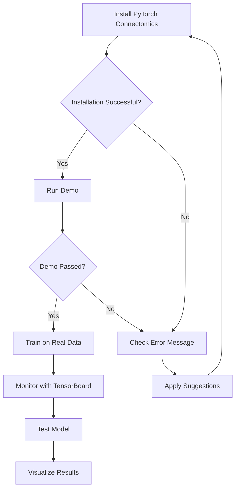

# Visual Guide for PyTorch Connectomics

This document provides visual aids and instructions for creating documentation visuals.

---

## Installation Flow Diagram

```
┌─────────────────────────────────────────────────────────────┐
│                  PyTorch Connectomics                        │
│                   Installation Flow                          │
└─────────────────────────────────────────────────────────────┘

Choose ONE method:

┌──────────────────┐   ┌──────────────────┐   ┌──────────────────┐
│  Quick Install   │   │  Python Script   │   │  Manual Install  │
│  (2-3 minutes)   │   │  (2-3 minutes)   │   │  (5-10 minutes)  │
└────────┬─────────┘   └────────┬─────────┘   └────────┬─────────┘
         │                      │                      │
         │                      │                      │
         ▼                      ▼                      ▼
┌─────────────────┐   ┌─────────────────┐   ┌─────────────────┐
│ curl quickstart │   │  git clone      │   │  conda create   │
│     .sh         │   │  python install │   │  conda install  │
└────────┬────────┘   └────────┬────────┘   └────────┬────────┘
         │                     │                      │
         │                     │                      │
         └─────────────────────┴──────────────────────┘
                              │
                              ▼
                    ┌──────────────────┐
                    │  conda activate  │
                    │       pytc       │
                    └─────────┬────────┘
                              │
                              ▼
                    ┌──────────────────┐
                    │  python main.py  │
                    │      --demo      │
                    └─────────┬────────┘
                              │
                              ▼
                    ┌──────────────────┐
                    │ ✅ Installation  │
                    │    Verified!     │
                    └──────────────────┘
```

---

## Training Workflow Diagram

```
┌─────────────────────────────────────────────────────────────┐
│              PyTorch Connectomics Workflow                   │
└─────────────────────────────────────────────────────────────┘

Step 1: Prepare Data
┌─────────────────────────────────────────────────────────────┐
│  EM Images (HDF5/TIFF)     +     Labels (HDF5/TIFF)         │
│  [165, 1024, 1024]              [165, 1024, 1024]           │
└────────────────────────────┬────────────────────────────────┘
                             │
                             ▼
Step 2: Create Config
┌─────────────────────────────────────────────────────────────┐
│  config.yaml:                                                │
│    model: monai_basic_unet3d                                │
│    data:                                                     │
│      patch_size: [128, 128, 128]                            │
│      batch_size: 2                                           │
│    optimization:                                             │
│      max_epochs: 100                                         │
└────────────────────────────┬────────────────────────────────┘
                             │
                             ▼
Step 3: Train
┌─────────────────────────────────────────────────────────────┐
│  $ python scripts/main.py --config config.yaml              │
│                                                              │
│  [Pre-flight checks]  ✓                                     │
│  [Loading data]       ✓                                     │
│  [Building model]     ✓                                     │
│  [Training...]        ━━━━━━━━━━━━━━━━ 50/100 epochs       │
└────────────────────────────┬────────────────────────────────┘
                             │
                             ▼
Step 4: Monitor
┌─────────────────────────────────────────────────────────────┐
│  $ tensorboard --logdir outputs/experiment                  │
│                                                              │
│  ┌────────────────────────────────────────────────┐         │
│  │  Training Loss          Validation Loss        │         │
│  │  ─────────────          ───────────────        │         │
│  │  ↘                      ↘                      │         │
│  │    ↘                      ↘                    │         │
│  │      ─────────              ─────────          │         │
│  └────────────────────────────────────────────────┘         │
└────────────────────────────┬────────────────────────────────┘
                             │
                             ▼
Step 5: Test
┌─────────────────────────────────────────────────────────────┐
│  $ python scripts/main.py --mode test                       │
│      --checkpoint best.ckpt                                 │
│                                                              │
│  Dice Score: 0.923                                          │
│  IoU: 0.857                                                 │
└────────────────────────────┬────────────────────────────────┘
                             │
                             ▼
Step 6: Visualize
┌─────────────────────────────────────────────────────────────┐
│  Input Image    Ground Truth    Prediction    Overlay       │
│  ┌─────────┐   ┌─────────┐    ┌─────────┐   ┌─────────┐   │
│  │         │   │ ██      │    │ ██      │   │ ██      │   │
│  │  ░░░░   │   │ ██ ░░   │    │ ██ ░░   │   │ ██ ░░   │   │
│  │ ░░░░░░  │   │░░░ ██   │    │░░░ ██   │   │░░░ ██   │   │
│  └─────────┘   └─────────┘    └─────────┘   └─────────┘   │
└─────────────────────────────────────────────────────────────┘
```

---

## Architecture Overview

```
┌─────────────────────────────────────────────────────────────┐
│         PyTorch Connectomics Architecture (v2.0)            │
└─────────────────────────────────────────────────────────────┘

                    ┌─────────────────────┐
                    │   User Interface    │
                    │  (scripts/main.py)  │
                    └──────────┬──────────┘
                               │
                               ▼
                    ┌─────────────────────┐
                    │   Configuration     │
                    │  (Hydra/OmegaConf)  │
                    └──────────┬──────────┘
                               │
                ┌──────────────┴──────────────┐
                ▼                             ▼
    ┌──────────────────────┐     ┌──────────────────────┐
    │  PyTorch Lightning   │     │       MONAI          │
    │  (Orchestration)     │     │   (Medical Tools)    │
    │                      │     │                      │
    │  • Training loop     │     │  • Models            │
    │  • Distributed       │     │  • Transforms        │
    │  • Mixed precision   │     │  • Loss functions    │
    │  • Callbacks         │     │  • Metrics           │
    └──────────┬───────────┘     └──────────┬───────────┘
               │                            │
               └────────────┬───────────────┘
                            ▼
                 ┌────────────────────┐
                 │     PyTorch        │
                 │  (Deep Learning)   │
                 └────────────────────┘

┌─────────────────────────────────────────────────────────────┐
│  Key Principle:                                              │
│  • Lightning = Outer shell (orchestration)                  │
│  • MONAI = Inner toolbox (domain-specific)                  │
│  • No reimplementation of standard components               │
└─────────────────────────────────────────────────────────────┘
```

---

## Data Format

```
┌─────────────────────────────────────────────────────────────┐
│              Supported Data Formats                          │
└─────────────────────────────────────────────────────────────┘

HDF5 (.h5, .hdf5) - RECOMMENDED
├── Structure:
│   ├── file.h5
│   │   └── "main" (or custom key)
│   │       └── data: [D, H, W] or [C, D, H, W]
│   └── Example:
│       └── train_image.h5/main: [165, 1024, 1024]
│
TIFF (.tif, .tiff)
├── Multi-page TIFF stacks
├── Each page = one slice
└── Automatically stacked into 3D volume
│
Zarr
├── For very large datasets (>100 GB)
├── Chunked storage
└── Lazy loading

┌─────────────────────────────────────────────────────────────┐
│  Data Shape Convention:                                      │
│  Input: (batch, channels, depth, height, width)             │
│  Example: (2, 1, 128, 128, 128)                             │
│           ↑  ↑   ↑    ↑    ↑                                │
│           │  │   │    │    └─── Width                       │
│           │  │   │    └──────── Height                      │
│           │  │   └───────────── Depth (Z)                   │
│           │  └───────────────── Channels (1=grayscale)      │
│           └──────────────────── Batch size                  │
└─────────────────────────────────────────────────────────────┘
```

---

## Model Architectures

```
┌─────────────────────────────────────────────────────────────┐
│              Available Model Architectures                   │
└─────────────────────────────────────────────────────────────┘

MONAI Models
├── monai_basic_unet3d (RECOMMENDED for beginners)
│   ├── Fast & simple
│   ├── 5.6M parameters
│   └── Good baseline performance
│
├── monai_unet
│   ├── U-Net with residual units
│   ├── 7.8M parameters
│   └── Better for complex structures
│
├── monai_unetr (Transformer-based)
│   ├── UNETR architecture
│   ├── 92.1M parameters
│   └── State-of-the-art for some tasks
│
└── monai_swin_unetr
    ├── Swin Transformer U-Net
    ├── 62.2M parameters
    └── Good for large-scale data

MedNeXt Models (MICCAI 2023)
├── mednext (size: S)
│   ├── ConvNeXt-based
│   ├── 5.6M parameters
│   └── Fast & accurate
│
├── mednext (size: B)
│   ├── 10.5M parameters
│   └── Balanced
│
├── mednext (size: M)
│   ├── 17.6M parameters
│   └── High accuracy
│
└── mednext (size: L)
    ├── 61.8M parameters
    └── State-of-the-art

┌─────────────────────────────────────────────────────────────┐
│  Choosing a Model:                                           │
│  • Beginners → monai_basic_unet3d                           │
│  • Speed → mednext (size: S)                                │
│  • Accuracy → mednext (size: L) or monai_swin_unetr        │
│  • Limited GPU → monai_basic_unet3d (smallest)             │
└─────────────────────────────────────────────────────────────┘
```

---

## Error Handling Flow

```
┌─────────────────────────────────────────────────────────────┐
│            Error Handling & Pre-flight Checks                │
└─────────────────────────────────────────────────────────────┘

User runs: python scripts/main.py --config config.yaml
                    │
                    ▼
         ┌──────────────────────┐
         │  Load Configuration  │
         └──────────┬───────────┘
                    ▼
         ┌──────────────────────┐
         │  Pre-flight Checks   │
         │                      │
         │  ✓ Data files exist? │
         │  ✓ GPU available?    │
         │  ✓ Memory OK?        │
         │  ✓ Patch size OK?    │
         └──────────┬───────────┘
                    │
         ┌──────────┴────────────┐
         ▼                       ▼
    ┌────────┐            ┌────────────┐
    │  Pass  │            │   Issues   │
    └───┬────┘            │   Found    │
        │                 └─────┬──────┘
        │                       │
        │                       ▼
        │              ┌─────────────────┐
        │              │  Show Issues +  │
        │              │   Suggestions   │
        │              └────────┬────────┘
        │                       │
        │                       ▼
        │              ┌─────────────────┐
        │              │ Continue? [y/N] │
        │              └────────┬────────┘
        │                       │
        │              ┌────────┴─────────┐
        │              ▼                  ▼
        │         ┌────────┐         ┌────────┐
        │         │  Yes   │         │   No   │
        │         └───┬────┘         └───┬────┘
        │             │                  │
        └─────────────┴──────────────────┘
                      │                  │
                      ▼                  ▼
              ┌────────────┐      ┌──────────┐
              │   Train    │      │   Exit   │
              └────────────┘      └──────────┘
                      │
                      ▼
         ┌────────────────────────┐
         │   Error during train?  │
         └────────┬───────────────┘
                  │
         ┌────────┴─────────┐
         ▼                  ▼
    ┌─────────┐      ┌──────────────┐
    │ Success │      │ Error Handler│
    └─────────┘      └──────┬───────┘
                             │
                             ▼
                   ┌──────────────────┐
                   │  Helpful Message │
                   │  + Suggestions   │
                   │  + Links to Help │
                   └──────────────────┘
```

---

## Screenshot Locations

### Installation Screenshots

**File: `docs/images/install_quickstart.png`**
- Terminal showing quickstart.sh execution
- Green checkmarks for each step
- Final success message

**File: `docs/images/install_demo.png`**
- Running `python scripts/main.py --demo`
- Progress bars
- Success message with next steps

### Training Screenshots

**File: `docs/images/training_start.png`**
- Initial training output
- Pre-flight checks passing
- Model summary

**File: `docs/images/tensorboard.png`**
- TensorBoard interface
- Training curves (loss, metrics)
- Multiple tabs shown

**File: `docs/images/training_progress.png`**
- Rich progress bar
- Loss values
- ETA/speed info

### Results Screenshots

**File: `docs/images/predictions.png`**
- 3x3 grid:
  - Row 1: Input, Ground Truth, Prediction
  - Row 2: Different slice
  - Row 3: Different slice

**File: `docs/images/overlay.png`**
- EM image with prediction overlay (red/green)
- Good and bad predictions highlighted

### Error Screenshots

**File: `docs/images/error_helpful.png`**
- Example of helpful error message
- Colored output
- Suggestions list
- Links to help

---

## Creating Screenshots

### Requirements
- High-resolution (at least 1920x1080)
- Dark terminal theme (more professional)
- Clean, uncluttered background
- Clear, readable text (14pt+ font)

### Tools
- **Terminal:** iTerm2 (Mac), Windows Terminal, Terminator (Linux)
- **Screenshot:** Built-in tools, Flameshot (Linux), Snagit
- **Annotation:** Draw.io, Excalidraw, Figma

### Style Guide
- **Font:** Monospace (Fira Code, JetBrains Mono)
- **Colors:** Solarized Dark, Dracula, or One Dark
- **Annotations:**
  - Red boxes for errors
  - Green boxes for success
  - Blue arrows for callouts
  - Yellow highlights for important

### Example Commands to Screenshot

```bash
# Installation
curl -fsSL https://raw.githubusercontent.com/zudi-lin/pytorch_connectomics/v2.0/quickstart.sh | bash

# Demo
python scripts/main.py --demo

# Training
python scripts/main.py --config tutorials/monai_lucchi++.yaml

# TensorBoard
tensorboard --logdir outputs/

# Testing
python scripts/main.py --mode test --checkpoint best.ckpt
```

---

## GIF Animations

### `docs/images/install.gif`
- Show full installation process
- 10-15 seconds
- Tool: asciinema + agg

```bash
# Record
asciinema rec install.cast

# Convert to GIF
agg install.cast install.gif
```

### `docs/images/demo.gif`
- Show demo running
- Show success message
- 5-10 seconds

### `docs/images/training.gif`
- Show training epochs progressing
- Loss decreasing
- 10-15 seconds

---

## Diagram Tools

### Recommended Tools
1. **Mermaid** (for flowcharts in Markdown)
2. **Draw.io** (for complex diagrams)
3. **Excalidraw** (for hand-drawn style)
4. **ASCII diagrams** (for terminal-friendly)

### Example Mermaid Diagram



---

## Next Steps

1. **Generate Screenshots:**
   - Run through each workflow
   - Capture high-quality screenshots
   - Save in `docs/images/`

2. **Create GIFs:**
   - Use asciinema for terminal recordings
   - Convert to GIF with agg or gifski
   - Optimize file size (<5MB)

3. **Update Documentation:**
   - Add images to README.md
   - Add to QUICKSTART.md
   - Add to online docs

4. **Video Tutorial:**
   - See VIDEO_TUTORIAL_SCRIPT.md for script
   - Record screencast
   - Upload to YouTube
   - Link from README

---

## Resources

- **ASCII Art:** https://asciiflow.com/
- **Mermaid:** https://mermaid.live/
- **Draw.io:** https://app.diagrams.net/
- **Excalidraw:** https://excalidraw.com/
- **Asciinema:** https://asciinema.org/
- **GIF Tools:** https://github.com/asciinema/agg
